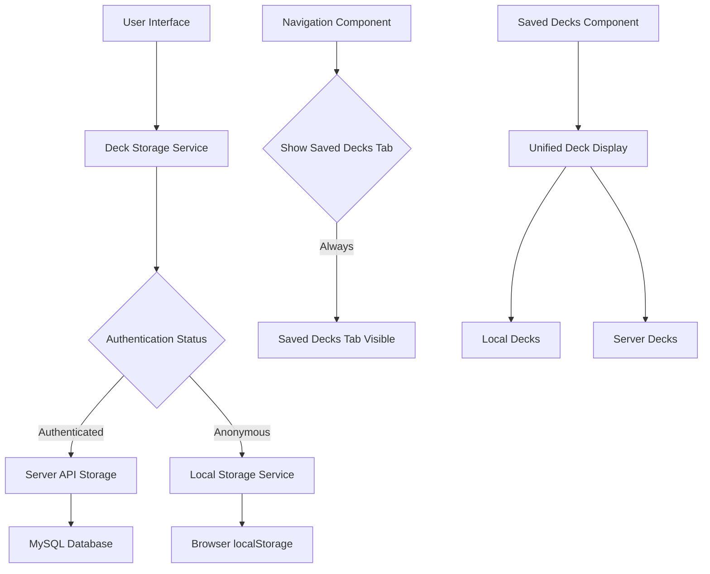

# Design Document

## Overview

The anonymous deck storage feature restores the "Saved Decks" functionality for users who are not authenticated by implementing browser-based local storage. This design ensures that both authenticated and anonymous users can save and manage decks, with clear separation between local storage (anonymous users) and server storage (authenticated users). The solution maintains backward compatibility while providing a seamless experience regardless of authentication status.

## Architecture

### High-Level Architecture



### Storage Strategy

The application will use a dual storage approach:
- **Anonymous Users**: Browser localStorage for deck persistence
- **Authenticated Users**: Server-side MySQL storage (existing functionality)
- **Mixed State**: Users who sign in after using anonymous storage will see both local and server decks

## Components and Interfaces

### 1. Local Storage Service

**Purpose**: Handle all browser localStorage operations for deck management

**Interface**:
```typescript
interface LocalStorageService {
  // Core CRUD operations
  saveLocalDeck(deck: Omit<Deck, 'id'>): Promise<Deck>;
  getLocalDecks(): Promise<Deck[]>;
  updateLocalDeck(id: string, updates: Partial<Deck>): Promise<Deck>;
  deleteLocalDeck(id: string): Promise<void>;
  
  // Utility methods
  getNextLocalId(): string;
  isLocalStorageAvailable(): boolean;
  clearAllLocalDecks(): Promise<void>;
}
```

**Implementation Details**:
- Use `localStorage.setItem()` and `localStorage.getItem()` for persistence
- Store decks under key `clash_deck_builder_local_decks`
- Generate unique IDs using timestamp + random string (e.g., `local_${Date.now()}_${Math.random()}`)
- Implement error handling for localStorage quota exceeded
- Validate data integrity on read operations

### 2. Unified Deck Storage Service

**Purpose**: Provide a single interface for deck operations regardless of storage type

**Interface**:
```typescript
interface DeckStorageService {
  // Unified operations that work for both local and server storage
  getAllDecks(): Promise<{ localDecks: Deck[], serverDecks: Deck[] }>;
  saveDeck(deck: Omit<Deck, 'id'>, forceLocal?: boolean): Promise<Deck>;
  updateDeck(id: string, updates: Partial<Deck>): Promise<Deck>;
  deleteDeck(id: string): Promise<void>;
  
  // Utility methods
  isLocalDeck(id: string): boolean;
  getStorageType(): 'local' | 'server' | 'mixed';
}
```

### 3. Enhanced Navigation Component

**Purpose**: Always show the "Saved Decks" tab regardless of authentication status

**Changes Required**:
- Remove authentication check for "Saved Decks" tab visibility
- Update navigation logic in `App.tsx`
- Maintain active state styling for the tab

### 4. Enhanced Saved Decks Component

**Purpose**: Display and manage both local and server decks in a unified interface

**New Features**:
- Display storage type indicators (local vs server)
- Handle mixed storage scenarios
- Provide clear visual distinction between deck sources
- Maintain all existing functionality (rename, delete, load)

**Interface Updates**:
```typescript
interface SavedDecksProps {
  onSelectDeck: (deck: Deck) => void;
  onNotification?: (message: string, type: 'success' | 'error' | 'info') => void;
  refreshTrigger?: number;
}

// New internal state
interface SavedDecksState {
  localDecks: Deck[];
  serverDecks: Deck[];
  loading: boolean;
  error: string | null;
  storageType: 'local' | 'server' | 'mixed';
}
```

### 5. Enhanced Deck Builder Component

**Purpose**: Support saving to local storage for anonymous users

**Changes Required**:
- Update save functionality to use unified storage service
- Provide option to save locally vs server (for authenticated users)
- Handle storage type selection in save dialog

## Data Models

### Local Storage Data Structure

```typescript
// Stored in localStorage under key: 'clash_deck_builder_local_decks'
interface LocalStorageData {
  version: string; // For future migration compatibility
  decks: LocalDeck[];
  metadata: {
    created: string;
    lastModified: string;
    deckCount: number;
  };
}

interface LocalDeck extends Omit<Deck, 'id'> {
  id: string; // Format: 'local_${timestamp}_${random}'
  storageType: 'local';
  created_at: string;
  updated_at: string;
}
```

### Enhanced Deck Interface

```typescript
// Extend existing Deck interface to support storage type identification
interface Deck {
  id?: number | string; // Support both numeric (server) and string (local) IDs
  name: string;
  slots: DeckSlot[];
  average_elixir: number;
  created_at?: string;
  updated_at?: string;
  storageType?: 'local' | 'server'; // New field to identify storage source
}
```

## Error Handling

### Local Storage Errors

1. **Storage Not Available**:
   - Detect using `typeof(Storage) !== "undefined"`
   - Display user-friendly message
   - Gracefully degrade to session-only functionality

2. **Quota Exceeded**:
   - Catch `QuotaExceededError`
   - Prompt user to delete old decks
   - Provide option to clear all local data

3. **Data Corruption**:
   - Validate JSON structure on read
   - Handle malformed data gracefully
   - Provide recovery options (clear corrupted data)

### Mixed Storage Scenarios

1. **Server Unavailable**:
   - Fall back to local storage only
   - Display appropriate status message
   - Queue server operations for retry

2. **Authentication State Changes**:
   - Handle login/logout transitions smoothly
   - Maintain local deck visibility
   - Provide migration options

## Testing Strategy

### Unit Tests

1. **LocalStorageService**:
   - Test CRUD operations
   - Mock localStorage for consistent testing
   - Test error scenarios (quota exceeded, unavailable)
   - Validate data integrity and format

2. **DeckStorageService**:
   - Test unified interface operations
   - Mock both local and server storage
   - Test authentication state transitions
   - Validate storage type detection

3. **Component Tests**:
   - Test navigation tab visibility
   - Test deck display with mixed sources
   - Test storage type indicators
   - Test error state handling

### Integration Tests

1. **End-to-End Deck Management**:
   - Save deck as anonymous user
   - Load and modify saved deck
   - Delete deck and verify removal
   - Test maximum deck limit (20 decks)

2. **Authentication Transitions**:
   - Start as anonymous user with saved decks
   - Sign in and verify both local and server decks visible
   - Sign out and verify local decks still accessible

3. **Storage Fallback**:
   - Test behavior when server is unavailable
   - Test localStorage quota scenarios
   - Test data migration between storage types

### Browser Compatibility Tests

1. **localStorage Support**:
   - Test in browsers with localStorage disabled
   - Test in private/incognito mode
   - Test storage persistence across browser sessions

2. **Cross-Browser Consistency**:
   - Verify data format compatibility
   - Test storage limits across browsers
   - Validate error handling consistency

## Implementation Phases

### Phase 1: Core Local Storage Infrastructure
- Implement LocalStorageService
- Add storage type detection
- Create unified DeckStorageService interface

### Phase 2: Navigation and UI Updates
- Update App.tsx navigation logic
- Modify SavedDecks component for mixed storage
- Add storage type indicators

### Phase 3: Enhanced Deck Builder Integration
- Update save functionality
- Add storage type selection
- Implement error handling

### Phase 4: Testing and Polish
- Comprehensive testing suite
- Error scenario handling
- Performance optimization
- Documentation updates

## Security Considerations

### Data Privacy
- Local storage data remains on user's device
- No sensitive information stored locally
- Clear data retention policies

### Data Validation
- Validate all data read from localStorage
- Sanitize user input for deck names
- Prevent XSS through proper data handling

### Storage Limits
- Implement deck count limits (20 decks maximum)
- Monitor localStorage usage
- Provide cleanup mechanisms

## Performance Considerations

### localStorage Operations
- Minimize read/write operations
- Batch updates when possible
- Implement lazy loading for large datasets

### Memory Management
- Avoid keeping all deck data in memory
- Implement efficient data structures
- Clean up unused references

### User Experience
- Provide loading states for storage operations
- Implement optimistic updates where safe
- Handle slow storage operations gracefully

## Migration Strategy

### Future Server Migration
- Design local storage format for easy server migration
- Provide export/import functionality
- Support bulk migration operations

### Data Format Versioning
- Include version field in localStorage data
- Plan for future format changes
- Implement backward compatibility

## Monitoring and Analytics

### Usage Tracking
- Track local vs server storage usage
- Monitor storage errors and failures
- Analyze user behavior patterns

### Performance Metrics
- Measure storage operation times
- Track localStorage usage patterns
- Monitor error rates and types