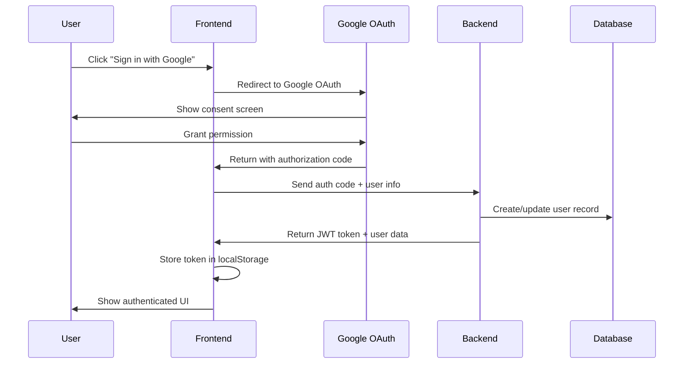
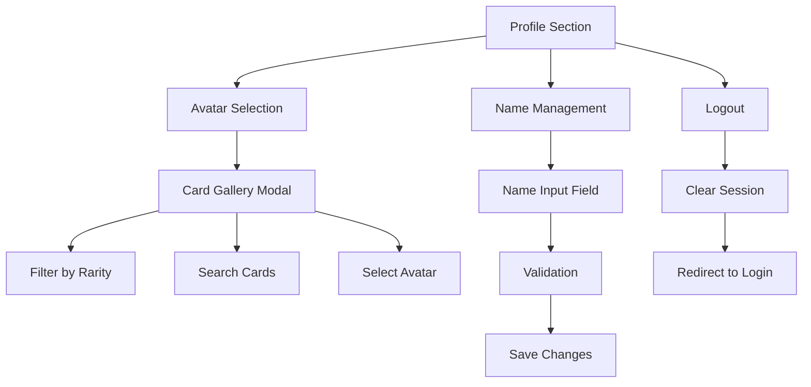

# Design Document

## Overview

This design implements Google OAuth authentication and user profile management for the Clash Royale Deck Builder. The solution integrates Google Identity Services for secure authentication, adds a profile management system with card-based avatars, and includes proper user session management. The design maintains the existing deck building functionality while adding user account persistence.

## Architecture

### Authentication Flow


### User Profile Management


## Components and Interfaces

### Frontend Components

#### AuthProvider Component
- **Purpose**: Manages authentication state across the application
- **Props**: `children: ReactNode`
- **State**: `user: User | null`, `isLoading: boolean`, `isAuthenticated: boolean`
- **Methods**: `login()`, `logout()`, `updateProfile()`

#### GoogleSignInButton Component
- **Purpose**: Renders Google OAuth sign-in button
- **Props**: `onSuccess: (response) => void`, `onError: (error) => void`
- **Integration**: Uses Google Identity Services library

#### ProfileSection Component
- **Purpose**: Main profile management interface
- **Props**: `user: User`, `onProfileUpdate: (user) => void`
- **Features**: Avatar display, name editing, logout button

#### AvatarSelector Component
- **Purpose**: Modal for selecting Clash Royale card as avatar
- **Props**: `cards: Card[]`, `currentAvatar: string`, `onSelect: (cardId) => void`, `onClose: () => void`
- **Features**: Card filtering, search, rarity-based organization

#### Footer Component
- **Purpose**: Application footer with creator attribution
- **Props**: None (static content)
- **Content**: "Made with KIRO IDE by Levy Nunes (@levyvix)"

### Backend Endpoints

#### Authentication Endpoints
```typescript
POST /api/auth/google
// Body: { authCode: string, userInfo: GoogleUserInfo }
// Response: { token: string, user: User }

POST /api/auth/refresh
// Headers: Authorization: Bearer <token>
// Response: { token: string, user: User }

POST /api/auth/logout
// Headers: Authorization: Bearer <token>
// Response: { success: boolean }
```

#### Profile Endpoints
```typescript
GET /api/profile
// Headers: Authorization: Bearer <token>
// Response: { user: User }

PUT /api/profile
// Headers: Authorization: Bearer <token>
// Body: { name?: string, avatar?: string }
// Response: { user: User }
```

#### Enhanced Deck Endpoints
```typescript
GET /api/decks
// Headers: Authorization: Bearer <token>
// Response: { decks: Deck[] } // Only user's decks

POST /api/decks
// Headers: Authorization: Bearer <token>
// Body: { name: string, cards: Card[], evolutionSlots: EvolutionSlot[] }
// Response: { deck: Deck }
```

## Data Models

### User Model
```typescript
interface User {
  id: string;
  googleId: string;
  email: string;
  name: string;
  avatar: string; // Card ID for avatar
  createdAt: Date;
  updatedAt: Date;
}
```

### Enhanced Deck Model
```typescript
interface Deck {
  id: string;
  userId: string; // Foreign key to User
  name: string;
  cards: Card[];
  evolutionSlots: EvolutionSlot[];
  averageElixir: number;
  createdAt: Date;
  updatedAt: Date;
}
```

### Database Schema Updates
```sql
-- Users table
CREATE TABLE users (
  id VARCHAR(36) PRIMARY KEY,
  google_id VARCHAR(255) UNIQUE NOT NULL,
  email VARCHAR(255) NOT NULL,
  name VARCHAR(100) NOT NULL,
  avatar VARCHAR(50) DEFAULT NULL, -- Card ID
  created_at TIMESTAMP DEFAULT CURRENT_TIMESTAMP,
  updated_at TIMESTAMP DEFAULT CURRENT_TIMESTAMP ON UPDATE CURRENT_TIMESTAMP
);

-- Update decks table to include user association
ALTER TABLE decks ADD COLUMN user_id VARCHAR(36);
ALTER TABLE decks ADD FOREIGN KEY (user_id) REFERENCES users(id) ON DELETE CASCADE;
```

## Error Handling

### Authentication Errors
- **Google OAuth Failure**: Display user-friendly message, allow retry
- **Token Expiration**: Automatic refresh attempt, fallback to re-authentication
- **Network Errors**: Retry mechanism with exponential backoff

### Profile Management Errors
- **Invalid Name**: Real-time validation with clear error messages
- **Avatar Update Failure**: Rollback to previous avatar, show error notification
- **Session Loss**: Automatic redirect to login with context preservation

### Validation Rules
- **Display Name**: 
  - Length: 1-50 characters
  - Pattern: `/^[a-zA-Z0-9\s]+$/` (alphanumeric and spaces only)
  - No leading/trailing spaces
- **Avatar Selection**: Must be valid Clash Royale card ID

## Testing Strategy

### Frontend Testing
- **Unit Tests**: Individual components with mocked dependencies
- **Integration Tests**: Authentication flow end-to-end
- **User Interaction Tests**: Profile management workflows

### Backend Testing
- **API Tests**: All authentication and profile endpoints
- **Database Tests**: User CRUD operations and deck associations
- **Security Tests**: JWT token validation and authorization

### Test Scenarios
1. **Google OAuth Flow**: Complete sign-in process
2. **Profile Updates**: Avatar and name changes
3. **Session Management**: Token refresh and logout
4. **Deck Association**: User-specific deck operations
5. **Error Handling**: Network failures and invalid inputs

## Security Considerations

### Authentication Security
- **JWT Tokens**: Short-lived access tokens (15 minutes) with refresh tokens
- **Token Storage**: Secure storage in httpOnly cookies for refresh tokens
- **CSRF Protection**: SameSite cookie attributes and CSRF tokens

### Data Protection
- **Input Validation**: Server-side validation for all user inputs
- **SQL Injection Prevention**: Parameterized queries for all database operations
- **XSS Protection**: Content Security Policy headers and input sanitization

### Google OAuth Configuration
- **Google Cloud Project**: Create project in Google Cloud Console
- **OAuth 2.0 Credentials**: 
  - Client ID: Public identifier for the application
  - Client Secret: Private key for server-side token verification
- **Authorized Origins**: Configure allowed domains (localhost:3000 for dev, production domain)
- **Redirect URIs**: Specify callback URLs for OAuth flow

### Environment Variables Required
```bash
# Backend (.env)
GOOGLE_CLIENT_ID=your-client-id.apps.googleusercontent.com
GOOGLE_CLIENT_SECRET=your-client-secret

# Frontend (.env)
REACT_APP_GOOGLE_CLIENT_ID=your-client-id.apps.googleusercontent.com
```

### Google OAuth Security
- **Client ID Configuration**: Proper domain restrictions in Google Console
- **State Parameter**: CSRF protection in OAuth flow
- **Token Verification**: Server-side verification of Google ID tokens using Client Secret

## Google OAuth Setup Steps

### 1. Google Cloud Console Configuration
1. Go to [Google Cloud Console](https://console.cloud.google.com/)
2. Select your existing project or create a new one
3. Enable the Google Identity Services API:
   - Go to "APIs & Services" → "Library"
   - Search for "Google Identity Services API" and enable it
4. Configure OAuth consent screen:
   - Go to "APIs & Services" → "OAuth consent screen"
   - Choose "External" user type
   - Fill in application name: "Clash Royale Deck Builder"
   - Add your email as developer contact
5. Create OAuth 2.0 credentials:
   - Go to "APIs & Services" → "Credentials"
   - Click "Create Credentials" → "OAuth 2.0 Client IDs"
   - Choose "Web application"
   - Add authorized JavaScript origins:
     - `http://localhost:3000` (development)
     - `http://localhost:8000` (backend development)
     - Add your production domain when ready
   - Add authorized redirect URIs:
     - `http://localhost:3000/auth/callback` (development)
     - Add production callback URL when ready
6. Copy the Client ID and Client Secret for environment configuration

**Note**: If you have gcloud CLI configured, you can also use it to create these credentials programmatically.

### 2. Library Integration
- **Frontend**: Google Identity Services library (`https://accounts.google.com/gsi/client`)
- **Backend**: Google Auth Library for Python (`google-auth`, `google-auth-oauthlib`)

## Implementation Considerations

### Frontend Architecture
- **Context API**: Global authentication state management
- **Route Protection**: Higher-order component for authenticated routes
- **Persistent Login**: Automatic token refresh on app initialization

### Backend Architecture
- **Middleware**: JWT authentication middleware for protected routes
- **Service Layer**: Separate authentication service for OAuth handling
- **Database Layer**: User repository pattern for data access

### Performance Optimizations
- **Lazy Loading**: Profile components loaded on demand
- **Caching**: User profile data cached in frontend state
- **Optimistic Updates**: Immediate UI updates with rollback on failure

### Migration Strategy
- **Existing Data**: Handle transition from anonymous to authenticated usage
- **Backward Compatibility**: Graceful handling of existing deck data
- **User Onboarding**: Clear guidance for first-time Google sign-in users