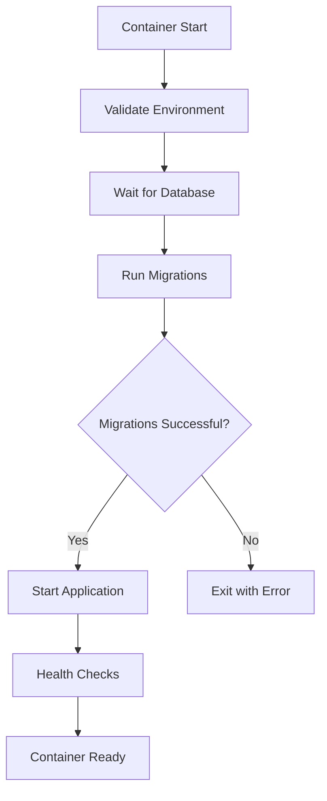

# Docker Integration for Database Migrations

This document describes how the database migration system integrates with Docker containers and the application startup process.

## Overview

The migration system is fully integrated with the Docker containerization setup, providing:

- **Automatic migration execution** during container startup
- **Health checks** that verify migration status
- **Manual migration tools** for troubleshooting
- **Logging and monitoring** of migration processes
- **Graceful error handling** and recovery

## Container Startup Flow



## Integration Components

### 1. Docker Entrypoint Script

**File**: `backend/docker-entrypoint.sh`

The entrypoint script orchestrates the container startup process:

1. **Environment Validation**: Checks required environment variables
2. **Database Readiness**: Waits for database to be accessible
3. **Migration Execution**: Runs pending migrations automatically
4. **Application Startup**: Starts the FastAPI application
5. **Error Handling**: Provides clear error messages and exits gracefully

### 2. Container Migration Runner

**File**: `database/migrations/container_migrate.py`

Specialized migration runner optimized for container environments:

- Uses environment variables for configuration
- Container-friendly logging to stdout
- Simplified error handling and reporting
- Integration with Docker health checks

### 3. Health Check System

**File**: `backend/health_check.py`

Comprehensive health checks that verify:

- Database connectivity
- Migration table existence and status
- Application endpoint responsiveness
- Overall system readiness

### 4. Manual Migration Tools

**Files**: 
- `scripts/run-migrations.sh` (Linux/macOS)
- `scripts/run-migrations.ps1` (Windows)

Command-line tools for manual migration management:

- Run migrations on demand
- Check migration status
- Execute rollbacks
- Troubleshoot migration issues

## Environment Configuration

### Required Environment Variables

The migration system requires these environment variables:

```bash
# Database Connection
DB_HOST=database              # Database container hostname
DB_PORT=3306                 # Database port
DB_USER=clash_user           # Database username
DB_PASSWORD=secure_password  # Database password
DB_NAME=clash_deck_builder   # Database name

# Optional Migration Settings
MIGRATION_TIMEOUT=300        # Migration timeout in seconds
MIGRATION_LOG_LEVEL=info     # Migration logging level
```

### Docker Compose Integration

The `docker-compose.yml` file includes:

```yaml
backend:
  environment:
    # Database connection for migrations
    DB_HOST: database
    DB_PORT: 3306
    DB_NAME: ${DB_NAME}
    DB_USER: ${DB_USER}
    DB_PASSWORD: ${DB_PASSWORD}
    
    # Migration settings
    MIGRATION_TIMEOUT: 300
    MIGRATION_LOG_LEVEL: info
  
  depends_on:
    database:
      condition: service_healthy  # Wait for database
  
  volumes:
    - migration_logs:/app/database/migrations/logs  # Persistent logs
  
  healthcheck:
    test: ["CMD", "python", "/usr/local/bin/health_check.py"]
    start_period: 60s  # Allow time for migrations
```

## Startup Process Details

### 1. Environment Validation

The entrypoint script validates required environment variables:

```bash
validate_environment() {
    local required_vars=("DB_HOST" "DB_USER" "DB_PASSWORD" "DB_NAME")
    local missing_vars=()
    
    for var in "${required_vars[@]}"; do
        if [ -z "${!var}" ]; then
            missing_vars+=("$var")
        fi
    done
    
    if [ ${#missing_vars[@]} -ne 0 ]; then
        echo "❌ Missing required environment variables: ${missing_vars[*]}"
        exit 1
    fi
}
```

### 2. Database Readiness Check

Waits for database to be accessible before proceeding:

```bash
wait_for_database() {
    local max_attempts=30
    local attempt=1
    
    while [ $attempt -le $max_attempts ]; do
        if python -c "
import mysql.connector
import os
try:
    conn = mysql.connector.connect(
        host=os.getenv('DB_HOST'),
        port=int(os.getenv('DB_PORT')),
        user=os.getenv('DB_USER'),
        password=os.getenv('DB_PASSWORD'),
        database=os.getenv('DB_NAME')
    )
    conn.close()
    exit(0)
except:
    exit(1)
"; then
            return 0
        fi
        
        sleep 2
        attempt=$((attempt + 1))
    done
    
    exit 1
}
```

### 3. Migration Execution

Runs migrations using the container-specific runner:

```bash
run_migrations() {
    cd /app/database/migrations
    
    if python container_migrate.py migrate; then
        echo "✅ Database migrations completed successfully"
    else
        echo "❌ Database migrations failed"
        exit 1
    fi
}
```

## Health Check Integration

### Health Check Components

The health check system verifies multiple aspects:

1. **Database Connection**: Can connect to MySQL database
2. **Migration Status**: Migrations table exists and is populated
3. **Application Health**: FastAPI application is responding

### Health Check Configuration

```dockerfile
HEALTHCHECK --interval=30s --timeout=30s --start-period=60s --retries=3 \
    CMD python /usr/local/bin/health_check.py || exit 1
```

The `start_period` is set to 60 seconds to allow time for:
- Database initialization
- Migration execution
- Application startup

## Manual Migration Management

### Using Shell Scripts

**Linux/macOS**:
```bash
# Run migrations
./scripts/run-migrations.sh migrate

# Check status
./scripts/run-migrations.sh status

# Rollback to version
./scripts/run-migrations.sh rollback 20241203_120000
```

**Windows**:
```powershell
# Run migrations
.\scripts\run-migrations.ps1 -Command migrate

# Check status
.\scripts\run-migrations.ps1 -Command status

# Rollback to version
.\scripts\run-migrations.ps1 -Command rollback -Target 20241203_120000
```

### Direct Container Access

Execute migrations directly in running container:

```bash
# Run migrations
docker exec -it clash-backend python /app/database/migrations/container_migrate.py migrate

# Check status
docker exec -it clash-backend python /app/database/migrations/container_migrate.py status

# Access migration logs
docker exec -it clash-backend tail -f /app/logs/migration.log
```

## Logging and Monitoring

### Log Locations

- **Container logs**: `docker logs clash-backend`
- **Migration logs**: `/app/database/migrations/logs/` (persistent volume)
- **Application logs**: `/app/logs/` (mounted volume)

### Log Formats

Migration logs include:

```
2024-12-03 12:00:00 - migrate - INFO - 🔄 Starting container migration process...
2024-12-03 12:00:01 - migrate - INFO - 📡 Connecting to database: database:3306/clash_deck_builder
2024-12-03 12:00:02 - migrate - INFO - ✅ Successfully applied 1 migrations:
2024-12-03 12:00:02 - migrate - INFO -   📦 20241203_120000
2024-12-03 12:00:02 - migrate - INFO - ⏱️  Total execution time: 150ms
```

### Monitoring Commands

```bash
# View container logs
docker logs -f clash-backend

# Check migration status
docker exec clash-backend python /app/database/migrations/container_migrate.py status

# View health check status
docker inspect clash-backend --format='{{.State.Health.Status}}'
```

## Troubleshooting

### Common Issues

#### 1. Container Fails to Start

**Symptoms**: Container exits immediately or fails health checks

**Diagnosis**:
```bash
# Check container logs
docker logs clash-backend

# Check if database is ready
docker exec clash-db mysqladmin ping -h localhost -u root -p
```

**Solutions**:
- Verify environment variables are set correctly
- Ensure database container is healthy
- Check migration file syntax
- Verify database permissions

#### 2. Migrations Fail

**Symptoms**: Migration errors in container logs

**Diagnosis**:
```bash
# Check migration status
docker exec clash-backend python /app/database/migrations/container_migrate.py status

# View detailed logs
docker logs clash-backend | grep -i migration
```

**Solutions**:
- Fix SQL syntax errors in migration files
- Resolve database schema conflicts
- Check database permissions
- Manual rollback if needed

#### 3. Health Checks Fail

**Symptoms**: Container marked as unhealthy

**Diagnosis**:
```bash
# Run health check manually
docker exec clash-backend python /usr/local/bin/health_check.py

# Check individual components
docker exec clash-backend curl -f http://localhost:8000/health
```

**Solutions**:
- Verify all services are running
- Check database connectivity
- Ensure migrations completed successfully
- Review application logs

### Recovery Procedures

#### 1. Reset Migration State

If migrations get into inconsistent state:

```bash
# Stop containers
docker-compose down

# Remove migration tracking (CAUTION: This will reset migration history)
docker exec clash-db mysql -u root -p${DB_ROOT_PASSWORD} -e "DROP TABLE IF EXISTS ${DB_NAME}.schema_migrations;"

# Restart with fresh migration state
docker-compose up -d
```

#### 2. Manual Migration Recovery

For complex migration issues:

```bash
# Access database directly
docker exec -it clash-db mysql -u root -p${DB_ROOT_PASSWORD} ${DB_NAME}

# Check current schema state
SHOW TABLES;
SELECT * FROM schema_migrations ORDER BY version;

# Manual migration cleanup if needed
DELETE FROM schema_migrations WHERE version = 'problematic_version';
```

#### 3. Container Rebuild

If container issues persist:

```bash
# Rebuild backend container
docker-compose build --no-cache backend

# Restart services
docker-compose down
docker-compose up -d
```

## Best Practices

### 1. Development Workflow

- Always test migrations locally before deployment
- Use development environment for migration testing
- Keep migration files small and focused
- Create rollback scripts for destructive changes

### 2. Production Deployment

- Backup database before running migrations
- Monitor migration execution during deployment
- Have rollback plan ready
- Test health checks after deployment

### 3. Monitoring and Maintenance

- Regularly check migration logs
- Monitor container health status
- Keep migration files organized
- Document complex migrations

### 4. Security Considerations

- Use secure database passwords
- Limit database user permissions
- Protect migration logs from unauthorized access
- Regular security updates for base images

## Integration Testing

### Test Migration System

```bash
# Test full stack startup
docker-compose down
docker-compose up -d

# Verify migrations ran
docker exec clash-backend python /app/database/migrations/container_migrate.py status

# Test health checks
docker exec clash-backend python /usr/local/bin/health_check.py

# Test application connectivity
curl http://localhost:8000/health
```

### Test Manual Tools

```bash
# Test manual migration script
./scripts/run-migrations.sh status

# Test rollback capability (with test migration)
./scripts/run-migrations.sh rollback 20241203_120000
./scripts/run-migrations.sh migrate
```

This integration ensures that database migrations are seamlessly handled as part of the containerized application lifecycle, providing reliability, monitoring, and troubleshooting capabilities for both development and production environments.