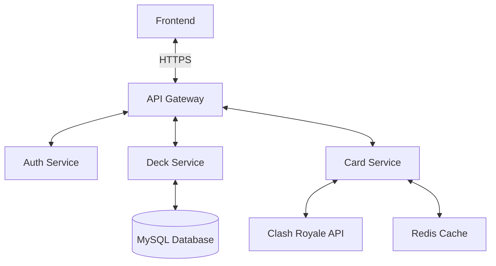
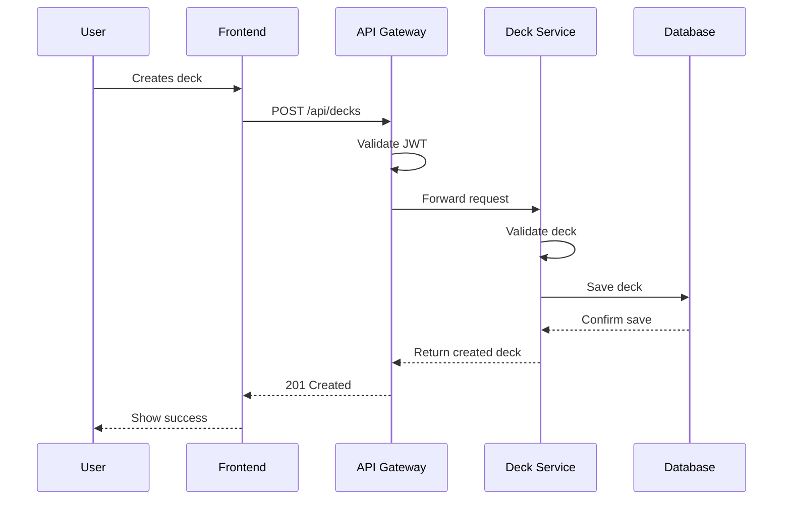
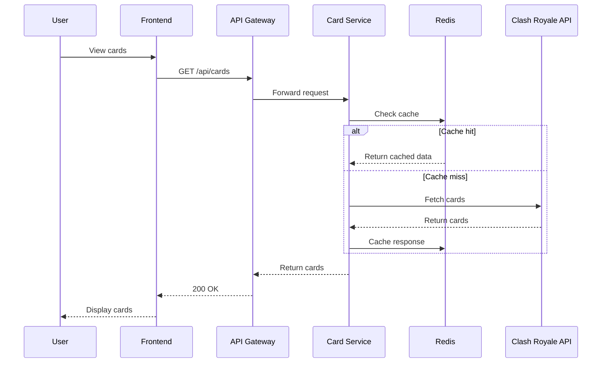

# System Architecture

This document provides an overview of the Clash Royale Deck Builder's system architecture, components, and their interactions.

## High-Level Architecture



## Core Components

### 1. Frontend (React)
- **Purpose**: User interface for deck building and management
- **Technologies**:
  - React 19.2+
  - TypeScript
  - React Router DOM
  - Redux for state management
  - Styled Components

### 2. Backend Services (FastAPI)

#### API Gateway
- **Purpose**: Entry point for all client requests
- **Responsibilities**:
  - Request routing
  - Authentication/Authorization
  - Rate limiting
  - Request/Response validation

#### Auth Service
- **Purpose**: Handle user authentication and authorization
- **Features**:
  - Google OAuth integration
  - JWT token generation/validation
  - User session management

#### Deck Service
- **Purpose**: Manage deck-related operations
- **Features**:
  - CRUD operations for decks
  - Deck validation
  - Average elixir calculation
  - Evolution card management

#### Card Service
- **Purpose**: Provide card data and metadata
- **Features**:
  - Card data retrieval
  - Caching layer
  - Card filtering and search

## Data Flow

### Deck Creation Flow


### Card Data Flow


## Data Storage

### MySQL Database
- **Schema**:
  ```sql
  -- Users table
  CREATE TABLE users (
      id INT AUTO_INCREMENT PRIMARY KEY,
      google_id VARCHAR(255) UNIQUE,
      email VARCHAR(255) UNIQUE,
      name VARCHAR(255),
      avatar TEXT,
      created_at TIMESTAMP DEFAULT CURRENT_TIMESTAMP,
      updated_at TIMESTAMP DEFAULT CURRENT_TIMESTAMP ON UPDATE CURRENT_TIMESTAMP
  );

  -- Decks table
  CREATE TABLE decks (
      id INT AUTO_INCREMENT PRIMARY KEY,
      user_id INT,
      name VARCHAR(100),
      cards JSON,
      evolutions JSON,
      average_elixir FLOAT,
      created_at TIMESTAMP DEFAULT CURRENT_TIMESTAMP,
      updated_at TIMESTAMP DEFAULT CURRENT_TIMESTAMP ON UPDATE CURRENT_TIMESTAMP,
      FOREIGN KEY (user_id) REFERENCES users(id) ON DELETE CASCADE
  );
  ```

### Redis Cache
- **Purpose**: Improve performance for frequently accessed data
- **Cached Data**:
  - Card data (24-hour TTL)
  - User sessions
  - Rate limiting counters

## Security

### Authentication
- JWT-based authentication
- Google OAuth 2.0 integration
- Secure token storage (HTTP-only cookies)

### Authorization
- Role-based access control (RBAC)
- Resource ownership validation
- Rate limiting per IP/User

### Data Protection
- All sensitive data encrypted at rest
- HTTPS for all communications
- Input validation and sanitization
- CORS policy enforcement

## Performance Considerations

### Caching Strategy
- Client-side caching (browser cache)
- Server-side caching (Redis)
- ETag support for efficient cache validation

### Database Optimization
- Indexes on frequently queried fields
- Connection pooling
- Query optimization

## Monitoring and Logging

### Logging
- Structured logging with log levels
- Request/Response logging
- Error tracking

### Monitoring
- Health check endpoints
- Performance metrics
- Error tracking integration

## Deployment Architecture

### Development
- Local development with Docker Compose
- Hot-reload for frontend and backend
- Local MySQL and Redis instances

### Production
- Containerized deployment with Docker
- Load balancing
- Auto-scaling
- Database replication
- CDN for static assets

## Future Considerations

### Scalability
- Database sharding
- Read replicas
- Microservices architecture

### Features
- Real-time deck sharing
- Deck win-rate tracking
- AI-powered deck suggestions
- Tournament support
