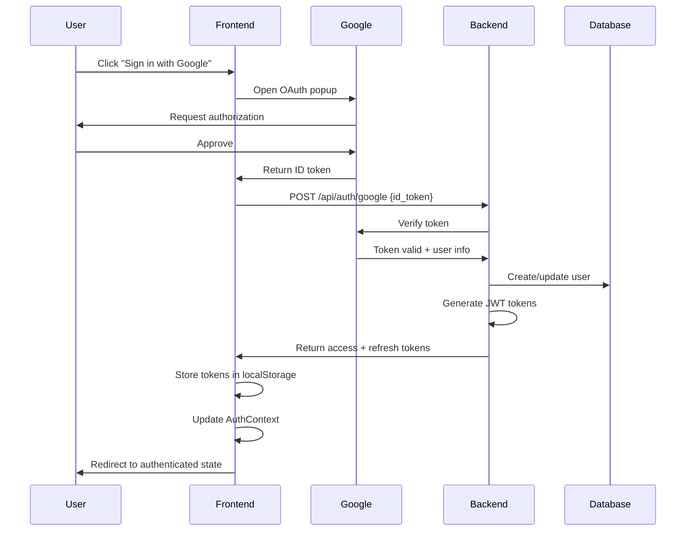

# Google OAuth Integration

Complete guide to the Google OAuth authentication system used in the Clash Royale Deck Builder.

## Overview

The application uses Google OAuth 2.0 for user authentication with these features:
- One-click sign-in with Google
- No password management required
- Secure token-based sessions (JWT)
- Automatic user profile creation
- Anonymous deck migration on first login

## Authentication Flow



## Setup

### Google Cloud Console

1. **Create Project**:
   - Go to [Google Cloud Console](https://console.cloud.google.com/)
   - Create a new project or select existing

2. **Enable Google Identity Services**:
   - Navigate to APIs & Services ’ Library
   - Search for "Google Identity Services"
   - Click Enable

3. **Create OAuth Credentials**:
   - Go to APIs & Services ’ Credentials
   - Click "Create Credentials" ’ "OAuth client ID"
   - Application type: "Web application"
   - Name: "Clash Deck Builder"

4. **Configure OAuth Consent Screen**:
   - User type: External
   - App name: "Clash Royale Deck Builder"
   - Support email: Your email
   - Scopes: email, profile

5. **Authorized JavaScript Origins**:
   ```
   http://localhost:3000
   http://127.0.0.1:3000
   https://yourdomain.com (production)
   ```

6. **Authorized Redirect URIs**:
   ```
   http://localhost:3000
   http://localhost:3000/auth/callback
   https://yourdomain.com (production)
   ```

7. **Get Credentials**:
   - Copy Client ID
   - Copy Client Secret (for backend)

### Environment Configuration

**Frontend (.env):**
```bash
REACT_APP_GOOGLE_CLIENT_ID=your-client-id.apps.googleusercontent.com
```

**Backend (.env):**
```bash
GOOGLE_CLIENT_ID=your-client-id.apps.googleusercontent.com
GOOGLE_CLIENT_SECRET=your-client-secret
```

## Frontend Implementation

### GoogleSignInButton Component

```typescript
// src/components/GoogleSignInButton.tsx
import { GoogleOAuthProvider, GoogleLogin } from '@react-oauth/google';
import { useAuth } from '../contexts/AuthContext';

export function GoogleSignInButton() {
  const { login } = useAuth();

  async function handleSuccess(credentialResponse: any) {
    try {
      await login(credentialResponse.credential);
    } catch (error) {
      console.error('Login failed:', error);
      showError('Failed to sign in with Google');
    }
  }

  function handleError() {
    showError('Google Sign-In was unsuccessful');
  }

  return (
    <GoogleLogin
      onSuccess={handleSuccess}
      onError={handleError}
      useOneTap
      theme="filled_blue"
      size="large"
      text="signin_with"
      shape="rectangular"
    />
  );
}

// Wrap app with provider
function App() {
  return (
    <GoogleOAuthProvider clientId={process.env.REACT_APP_GOOGLE_CLIENT_ID}>
      <AuthProvider>
        <YourApp />
      </AuthProvider>
    </GoogleOAuthProvider>
  );
}
```

### AuthContext

```typescript
// src/contexts/AuthContext.tsx
export function AuthProvider({ children }: { children: ReactNode }) {
  const [isAuthenticated, setIsAuthenticated] = useState(false);
  const [user, setUser] = useState<User | null>(null);

  async function login(idToken: string) {
    // Get local decks for migration
    const localDecks = localStorageService.getDecks();

    // Send to backend
    const response = await fetch('/api/auth/google', {
      method: 'POST',
      headers: { 'Content-Type': 'application/json' },
      body: JSON.stringify({
        id_token: idToken,
        migration_data: { decks: localDecks }
      })
    });

    if (!response.ok) {
      throw new Error('Authentication failed');
    }

    const data = await response.json();

    // Store tokens
    localStorage.setItem('access_token', data.access_token);
    localStorage.setItem('refresh_token', data.refresh_token);

    // Update state
    setUser(data.user);
    setIsAuthenticated(true);

    // Show migration results
    if (data.onboarding?.decks_migrated > 0) {
      showSuccess(`${data.onboarding.decks_migrated} decks migrated to your account!`);
    }
  }

  async function logout() {
    try {
      await fetch('/api/auth/logout', {
        method: 'POST',
        headers: {
          'Authorization': `Bearer ${localStorage.getItem('access_token')}`
        }
      });
    } finally {
      localStorage.removeItem('access_token');
      localStorage.removeItem('refresh_token');
      setUser(null);
      setIsAuthenticated(false);
    }
  }

  return (
    <AuthContext.Provider value={{ isAuthenticated, user, login, logout }}>
      {children}
    </AuthContext.Provider>
  );
}
```

## Backend Implementation

### Google Token Verification

```python
# src/services/auth_service.py
from google.oauth2 import id_token
from google.auth.transport import requests

class AuthService:
    def __init__(self):
        self.google_client_id = settings.GOOGLE_CLIENT_ID

    def verify_google_token(self, token: str) -> Dict[str, Any]:
        """Verify Google ID token and extract user info."""
        try:
            # Verify token with Google
            idinfo = id_token.verify_oauth2_token(
                token,
                requests.Request(),
                self.google_client_id
            )

            # Verify issuer
            if idinfo['iss'] not in ['accounts.google.com', 'https://accounts.google.com']:
                raise GoogleOAuthError('Invalid token issuer')

            # Extract user info
            return {
                'google_id': idinfo['sub'],
                'email': idinfo['email'],
                'name': idinfo.get('name', idinfo['email']),
                'picture': idinfo.get('picture')
            }
        except ValueError as e:
            raise GoogleOAuthError(f'Invalid token: {str(e)}')

    def generate_jwt_tokens(self, user: User) -> Dict[str, Any]:
        """Generate access and refresh JWT tokens."""
        access_token_expires = timedelta(
            minutes=settings.JWT_ACCESS_TOKEN_EXPIRE_MINUTES
        )
        refresh_token_expires = timedelta(
            days=settings.JWT_REFRESH_TOKEN_EXPIRE_DAYS
        )

        access_token = jwt.encode(
            {
                'user_id': user.id,
                'google_id': user.google_id,
                'email': user.email,
                'name': user.name,
                'exp': datetime.utcnow() + access_token_expires,
                'iat': datetime.utcnow(),
                'type': 'access'
            },
            settings.JWT_SECRET_KEY,
            algorithm='HS256'
        )

        refresh_token = jwt.encode(
            {
                'user_id': user.id,
                'exp': datetime.utcnow() + refresh_token_expires,
                'iat': datetime.utcnow(),
                'type': 'refresh'
            },
            settings.JWT_SECRET_KEY,
            algorithm='HS256'
        )

        return {
            'access_token': access_token,
            'refresh_token': refresh_token,
            'token_type': 'bearer',
            'expires_in': int(access_token_expires.total_seconds())
        }
```

### Login Endpoint

```python
# src/api/auth.py
@router.post("/google", response_model=AuthResponse)
async def google_oauth_callback(request: GoogleAuthRequest):
    """Handle Google OAuth callback and authenticate user."""
    auth_service = AuthService()
    user_service = UserService()
    migration_service = MigrationService()

    # Verify Google token
    google_user_info = auth_service.verify_google_token(request.id_token)

    # Create or update user
    user = user_service.create_or_update_user(
        google_id=google_user_info['google_id'],
        email=google_user_info['email'],
        name=google_user_info['name']
    )

    # Handle data migration
    onboarding_result = migration_service.handle_user_onboarding(
        user,
        request.migration_data
    )

    # Generate JWT tokens
    tokens = auth_service.generate_jwt_tokens(user)

    return AuthResponse(
        access_token=tokens['access_token'],
        refresh_token=tokens['refresh_token'],
        token_type=tokens['token_type'],
        expires_in=tokens['expires_in'],
        user={
            'id': user.id,
            'google_id': user.google_id,
            'email': user.email,
            'name': user.name,
            'avatar': user.avatar
        },
        onboarding=onboarding_result
    )
```

### User Creation

```python
# src/services/user_service.py
def create_or_update_user(
    self,
    google_id: str,
    email: str,
    name: str
) -> User:
    """Create new user or update existing user from Google OAuth."""
    with self.db_manager.get_connection() as conn:
        cursor = conn.cursor(dictionary=True)

        # Check if user exists
        cursor.execute(
            "SELECT * FROM users WHERE google_id = %s",
            (google_id,)
        )
        existing_user = cursor.fetchone()

        if existing_user:
            # Update existing user
            cursor.execute("""
                UPDATE users
                SET email = %s, name = %s, updated_at = CURRENT_TIMESTAMP
                WHERE google_id = %s
            """, (email, name, google_id))
            conn.commit()

            return User(**existing_user)
        else:
            # Create new user
            user_id = str(uuid.uuid4())
            cursor.execute("""
                INSERT INTO users (id, google_id, email, name)
                VALUES (%s, %s, %s, %s)
            """, (user_id, google_id, email, name))
            conn.commit()

            return User(
                id=user_id,
                google_id=google_id,
                email=email,
                name=name
            )
```

## JWT Token Management

### Access Token (15 minutes)

```json
{
  "user_id": "550e8400-e29b-41d4-a716-446655440000",
  "google_id": "1234567890",
  "email": "user@example.com",
  "name": "John Doe",
  "exp": 1705318800,
  "iat": 1705318200,
  "type": "access"
}
```

### Refresh Token (7 days)

```json
{
  "user_id": "550e8400-e29b-41d4-a716-446655440000",
  "exp": 1705923000,
  "iat": 1705318200,
  "type": "refresh"
}
```

### Token Refresh

```typescript
async function refreshAccessToken(): Promise<string> {
  const refreshToken = localStorage.getItem('refresh_token');

  const response = await fetch('/api/auth/refresh', {
    method: 'POST',
    headers: { 'Content-Type': 'application/json' },
    body: JSON.stringify({ refresh_token: refreshToken })
  });

  if (response.ok) {
    const data = await response.json();
    localStorage.setItem('access_token', data.access_token);
    return data.access_token;
  } else {
    // Refresh token expired - logout
    logout();
    throw new Error('Session expired');
  }
}
```

## Security Considerations

### Token Storage

!!! warning "Security Best Practice"
    Currently using localStorage. For production, consider:
    - httpOnly cookies for refresh tokens
    - In-memory storage for access tokens
    - Token rotation on refresh

### Token Validation

All protected endpoints validate JWT:

```python
def extract_user_from_token(self, token: str) -> Dict[str, Any]:
    """Extract and validate user info from JWT token."""
    try:
        payload = jwt.decode(
            token,
            settings.JWT_SECRET_KEY,
            algorithms=['HS256']
        )

        # Verify token type
        if payload.get('type') != 'access':
            raise TokenValidationError('Invalid token type')

        # Check expiration
        if payload.get('exp', 0) < datetime.utcnow().timestamp():
            raise TokenValidationError('Token expired')

        return payload
    except jwt.InvalidTokenError as e:
        raise TokenValidationError(f'Invalid token: {str(e)}')
```

## Testing

```typescript
describe('Google OAuth', () => {
  it('handles successful login', async () => {
    const mockCredential = { credential: 'mock-google-token' };

    global.fetch = jest.fn()
      .mockResolvedValueOnce({
        ok: true,
        json: async () => ({
          access_token: 'access-token',
          refresh_token: 'refresh-token',
          user: { id: '123', email: 'test@example.com' }
        })
      });

    await login(mockCredential.credential);

    expect(localStorage.getItem('access_token')).toBe('access-token');
  });

  it('migrates local decks on first login', async () => {
    // Setup local decks
    localStorageService.addDeck(mockDeck());

    await login('mock-token');

    // Verify migration
    const response = await fetchDecks();
    expect(response).toHaveLength(1);
  });
});
```

## Related Documentation

- [Authentication API](../api/authentication.md) - API endpoints
- [Anonymous Mode](anonymous-mode.md) - Anonymous user flow
- [Backend Architecture](../architecture/backend.md) - Auth service
- [Frontend Architecture](../architecture/frontend.md) - AuthContext
